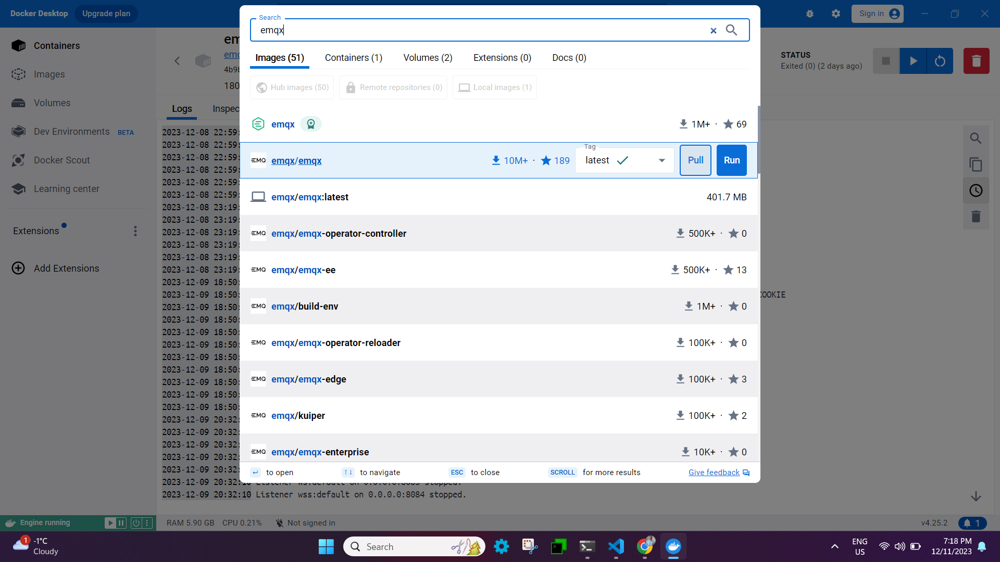

# emqx-kafka-mongo-messaging-app
The purpose this document is to use kafka for processing large amounts of data efficiently from IOT devices. But the challenge is, kafka was not designed for IOT devices. Hence integration of EMQX which uses mqtt lightweight protocol in conjunction with kafka can elevate wide range of opportunites to process the data in real-time.

Time sensitive application can largely benifit from this stack.

## Introduction
### EMQX
EMQX is an open-source, highly scalable, and feature-rich MQTT broker designed for IoT and real-time messaging applications. It supports up to 100 million concurrent IoT device connections per cluster while maintaining a throughput of 1 million messages per second and a millisecond latency.

EMQX supports various protocols, including MQTT (3.1, 3.1.1, and 5.0), HTTP, QUIC, and WebSocket. It also provides secure bi-directional communication with MQTT over TLS/SSL and various authentication mechanisms, ensuring reliable and efficient communication infrastructure for IoT devices and applications.

### KAFKA
Apache Kafka is a widely used open-source distributed event streaming platform that can handle the real-time transfer of data streams between applications and systems. However, Kafka is not built for edge IoT communication and Kafka clients require a stable network connection and more hardware resources. In the IoT realm, data generated from devices and applications are transmitted using the lightweight MQTT protocol. EMQX’s integration with Kafka/Confluent enables users to stream MQTT data seamlessly into or from Kafka. MQTT data streams are ingested into Kafka topics, ensuring real-time processing, storage, and analytics. Conversely, Kafka topics data can be consumed by MQTT devices, enabling timely actions.

In this article we are going to achieve the below architecture.


## Setting up EMQX
### Step 1: Running EMQX service
Docker is very handy tool when we want to setup the emqx server on the local machine. It can eliminate lot of choas and lets to run the emqx server setup with just 2 command like below,

```docker
docker pull emqx/emqx
docker run -d --name emqx -p 1883:1883 -p 8083:8083 -p 8084:8084 -p 8883:8883 -p 18083:18083 emqx/emqx
```

We can also use docker desktop in the windows machine to pull and run the emqx docker image.



Once you run the docker image, you should be able to see the logs that contains the details about ports on which emqx services are running. In EMQX, listener is configured to receive requests from MQTT clients. EMQX supports the following message transfer protocols, including:

    - TCP: port 1883
    - SSL: port 8883
    - Websocket listener: 8083
    - Secure websocket listener: 8084
    - For UI Dashboard: 18083
 


In EMQX, Dashboard is a web-based graphic interface to manage and monitor EMQX and connected devices in real time.
 Access the endpoint `<ipaddress>:18083`


Login into the dashboard using default credentials.

```
username: admin
password: public
```
when you login for the first time, it will prompt you to reset the password. Once we reset the password, it will redirect you to dashboard of emqx.


### Step 2: Create emqx publisher/subscriber files using python programming

- #### Step 1: using paho-mqtt python module
    This article mainly introduces how to use the paho-mqtt client and implement connection, subscribe, messaging, and other functions between the MQTT client and MQTT broker, in the Python project.

- #### Step 2: Install the Paho Mqtt Client
    `pip3 install paho-mqtt`

- #### Step 3: Create a emqx python publisher.
    ```
    from paho.mqtt import client as mqtt_client
    import random
    import logging
    import time

    # Create an MQTT Connection
    broker      = '192.168.48.1'
    port        = 1883
    topic       = "python/mqtt"
    client_id   = f'python-mqtt-{random.randint(0, 1000)}'
    username    = "admin"
    password    = "public"

    # Auto reconnect for reliable connection
    FIRST_RECONNECT_DELAY   = 1
    RECONNECT_RATE          = 2
    MAX_RECONNECT_COUNT     = 12
    MAX_RECONNECT_DELAY     = 60

    # on_connect callback function for connecting the broker.
    # This function is called after client call has successfully connected.

    def connect_mqtt():
        def on_connect(client, userdata, flags, rc):
            if rc == 0:
                print("Connected to MQTT Broker!")
            else:
                print("Failed to connect, return code %d\n", rc)
        
        def on_disconnect(client, userdata, rc):
            logging.info("Disconnected with result code: %s", rc)
            reconnect_count, reconnect_delay = 0, FIRST_RECONNECT_DELAY
            while reconnect_count < MAX_RECONNECT_COUNT:
                logging.info("Reconnecting in %d seconds...", reconnect_delay)
                time.sleep(reconnect_delay)
            
                try:
                    client.reconnect()
                    logging.info("Reconnected successfully!")
                    return
                except Exception as err:
                    logging.error("%s. Reconnect failed. Retrying...", err)

                reconnect_delay *= RECONNECT_RATE
                reconnect_delay = min(reconnect_delay, MAX_RECONNECT_DELAY)
                reconnect_count += 1
            logging.info("Reconnect failed after %s attempts. Exiting...", reconnect_count)

        # Set connecting Client ID
        client = mqtt_client.Client(client_id)
        client.username_pw_set(username, password)
        client.on_connect = on_connect
        client.connect(broker, port)
        client.on_disconnect = on_disconnect
        return client

    # publisher code
    def publish(client):
        msg_count = 1
        while True:
            time.sleep(1)
            msg = f"messages: {msg_count}"
            result = client.publish(topic, msg)
            status = result[0]
            if status == 0:
                print(f"Send `{msg}` to topic `{topic}`")
            else:
                print(f"Failed to send message to topic {topic}")
            msg_count += 1
            if msg_count > 5:
                break

    def run():
        client = connect_mqtt()
        client.loop_start()
        publish(client)
        client.loop_forever()

    if __name__ == "__main__":
        run()
    ```

- #### Step 4: Create a emqx python subscriber.
    ```
    import random
    from paho.mqtt import client as mqtt_client

    # Create an MQTT Connection
    broker      = '192.168.48.1'
    port        = 1883
    topic       = "python/mqtt"
    client_id   = f'subscribe-{random.randint(0, 1000)}'
    username    = "admin"
    password    = "public"

    def connect_mqtt() -> mqtt_client:
        def on_connect(client, userdata, flags, rc):
            if rc == 0:
                print("Connected to MQTT Broker!")
            else:
                print("Failed to connect, return code %d\n", rc)

        client = mqtt_client.Client(client_id)
        client.username_pw_set(username, password)
        client.on_connect = on_connect
        client.connect(broker, port)
        return client

    def subscribe(client: mqtt_client):
        def on_message(client, userdata, msg):
            print(f"Received `{msg.payload.decode()}` from `{msg.topic}` topic")

        client.subscribe(topic)
        client.on_message = on_message

    def run():
        client = connect_mqtt()
        subscribe(client)
        client.loop_forever()

    if __name__ == "__main__":
        run()
    ```

    > **_NOTE:_** These both the files are very basic. The publisher will send 5 message and then will stop. The subscriber will go into infinite loop for receiving messages from publisher. Feel free to tweak publisher logic to continuosly send the messages by removing below block in it.
    ```
    msg_count += 1
        if msg_count > 5:
            break
    ```

- #### Step 5: Execute the subscriber and Publisher
    Execute subscriber program in one terminal session and then run the publisher program in another session. you should be able to see something like below,

    

                    *** End of EMQX setup ***

## Setting up KAFKA (Assuming on Ubuntu platform)

The below diagram shows a high level overview of what Kafka is for beginners. (there's lot more to Kafka, like Zookeeper, Consumer Groups, Partitions, etc. but we'll leave that for another time.)


Kafka categorizes data into topics. A topic is a category or feed name to which records are published.


Producers publish messages to a specific topic. The messages can be in any format, with JSON and Avro being popular options. For example, a social media platform might use a producer to publish messages to a topic called posts whenever a user creates a post.


Consumers subscribe to a topic to consume the records published by producers. In the social media example, there might be a consumer set up to consume the posts topic to perform safety checks on the post before it is published to the global feed, and another consumer may asynchronously send notifications to the user's followers.

### Step 1: Installing Java
Apache Kafka can be run on all platforms supported by Java. In order to set up Kafka on the ubuntu system, you need to install java first. As we know, Oracle java is now commercially available, So we are using its open-source version OpenJDK.

```
sudo apt update 
sudo apt install default-jdk
```
```
java --version
openjdk 17.0.9 2023-10-17
OpenJDK Runtime Environment (build 17.0.9+9-Ubuntu-122.04)
OpenJDK 64-Bit Server VM (build 17.0.9+9-Ubuntu-122.04, mixed mode, sharing)
```

### Step 2: Download latest apache kafka
```
wget https://dlcdn.apache.org/kafka/3.6.1/kafka_2.13-3.6.1.tgz
```

Extract the archive file,
```
tar -xzf kafka_2.13-3.6.1.tgz
sudo mv kafka_2.13-3.6.1 /usr/local/kafka
```

### Step 3: Running Kafka service.
Now we have 2 ways to run the kafka service. One way would be navigating to /usr/local/kafka/bin and run the kafka script everytime. Second way is, running it as a unix service. We will go with running it as a service.
    
> **_NOTE:_** Apache Kafka can be started using ZooKeeper or KRaft. To get started with either configuration follow one the sections below but not both
    
- #### Step 1 - Creating System Unit Files
    ```
    sudo nano /etc/systemd/system/zookeeper.service
    ```

    And add the following content:

    ```
    [Unit]
    Description=Apache Zookeeper server
    Documentation=http://zookeeper.apache.org
    Requires=network.target remote-fs.target
    After=network.target remote-fs.target

    [Service]
    Type=simple
    ExecStart=/usr/local/kafka/bin/zookeeper-server-start.sh /usr/local/kafka/config/zookeeper.properties
    ExecStop=/usr/local/kafka/bin/zookeeper-server-stop.sh
    Restart=on-abnormal

    [Install]
    WantedBy=multi-user.target
    ```

    Save the file and close it.

    Next, to create a system unit file for the kafka service:

    ```
    sudo nano /etc/systemd/system/kafka.service
    ```

    Add the following content:

    ```
    [Unit]
    Description=Apache Kafka Server
    Documentation=http://kafka.apache.org/documentation.html
    Requires=zookeeper.service

    [Service]
    Type=simple
    Environment="JAVA_HOME=/usr/lib/jvm/java-1.17.0-openjdk-amd64"
    ExecStart=/usr/local/kafka/bin/kafka-server-start.sh /usr/local/kafka/config/server.properties
    ExecStop=/usr/local/kafka/bin/kafka-server-stop.sh

    [Install]
    WantedBy=multi-user.target
    ```

    Reload the systemd daemon to apply new changes.

    ```
    sudo systemctl daemon-reload
    ```

- #### Step 2 - Start Kafka and Zookeeper Service
    First, you need to start the ZooKeeper service and then start Kafka. Use the systemctl command to start a single-node ZooKeeper instance.

    ```
    sudo systemctl start zookeeper
    ```

    Now start the Kafka server and view the running status:

    ```
    sudo systemctl start kafka
    sudo systemctl status kafka
    ```

    ```
    devops@LAPTOP-JF1PIDLR:~/Documents/Personal/projects/General/emqx-kafka-mongo-messaging-app$ sudo vi /etc/systemd/system/kafka.service
    ● kafka.service - Apache Kafka Server
     Loaded: loaded (/etc/systemd/system/kafka.service; disabled; vendor preset: enabled)
     Active: active (running) since Tue 2023-12-12 13:41:12 EST; 6s ago
       Docs: http://kafka.apache.org/documentation.html
   Main PID: 50201 (java)
      Tasks: 83 (limit: 9396)
     Memory: 315.5M
     CGroup: /system.slice/kafka.service
             └─50201 /usr/lib/jvm/java-1.17.0-openjdk-amd64/bin/java -Xmx1G -Xms1G -server -XX:+UseG1GC -XX:MaxGCPauseMillis=20 -XX:InitiatingHeapOccupancyPercent=35 -XX:+ExplicitGCInvokesConcurrent -XX:MaxInlineLevel=15 -D>

    Dec 12 13:41:17 LAPTOP-JF1PIDLR kafka-server-start.sh[50201]: [2023-12-12 13:41:17,600] INFO [Controller id=0, targetBrokerId=0] Client requested connection close from node 0 (org.apache.kafka.clients.NetworkClient)
    Dec 12 13:41:17 LAPTOP-JF1PIDLR kafka-server-start.sh[50201]: [2023-12-12 13:41:17,614] INFO [/config/changes-event-process-thread]: Starting (kafka.common.ZkNodeChangeNotificationListener$ChangeEventProcessThread)
    Dec 12 13:41:17 LAPTOP-JF1PIDLR kafka-server-start.sh[50201]: [2023-12-12 13:41:17,634] INFO [SocketServer listenerType=ZK_BROKER, nodeId=0] Enabling request processing. (kafka.network.SocketServer)
    Dec 12 13:41:17 LAPTOP-JF1PIDLR kafka-server-start.sh[50201]: [2023-12-12 13:41:17,638] INFO Awaiting socket connections on 0.0.0.0:9092. (kafka.network.DataPlaneAcceptor)
    Dec 12 13:41:17 LAPTOP-JF1PIDLR kafka-server-start.sh[50201]: [2023-12-12 13:41:17,651] INFO Kafka version: 3.6.1 (org.apache.kafka.common.utils.AppInfoParser)
    Dec 12 13:41:17 LAPTOP-JF1PIDLR kafka-server-start.sh[50201]: [2023-12-12 13:41:17,652] INFO Kafka commitId: 5e3c2b738d253ff5 (org.apache.kafka.common.utils.AppInfoParser)
    Dec 12 13:41:17 LAPTOP-JF1PIDLR kafka-server-start.sh[50201]: [2023-12-12 13:41:17,652] INFO Kafka startTimeMs: 1702406477646 (org.apache.kafka.common.utils.AppInfoParser)
    Dec 12 13:41:17 LAPTOP-JF1PIDLR kafka-server-start.sh[50201]: [2023-12-12 13:41:17,653] INFO [KafkaServer id=0] started (kafka.server.KafkaServer)
    Dec 12 13:41:17 LAPTOP-JF1PIDLR kafka-server-start.sh[50201]: [2023-12-12 13:41:17,843] INFO [zk-broker-0-to-controller-forwarding-channel-manager]: Recorded new controller, from now on will use node LAPTOP-JF1PIDLR.:9092 (>
    Dec 12 13:41:17 LAPTOP-JF1PIDLR kafka-server-start.sh[50201]: [2023-12-12 13:41:17,861] INFO [zk-broker-0-to-controller-alter-partition-channel-manager]: Recorded new controller, from now on will use node LAPTOP-JF1PIDLR.:9
    ```

    All done. The Kafka installation has been successfully completed. The part of this tutorial will help you to work with the Kafka server.

### Step 4: Create a Topic in Kafka
Kafka provides multiple pre-built shell scripts to work on it. First, create a topic named “emqx-to-kafka” with a single partition with a single replica:

```
cd /usr/local/kafka
bin/kafka-topics.sh --create --bootstrap-server localhost:9092 --replication-factor 1 --partitions 1 --topic emqx-to-kafka

Created topic emqx-to-kafka.
```

The replication factor describes how many copies of data will be created. As we are running with a single instance keep this value 1. Set the partition options as the number of brokers you want your data to be split between. As we are running with a single broker keep this value 1. You can create multiple topics by running the same command as above.

After that, you can see the created topics on Kafka by the running below command:

```
devops@LAPTOP-JF1PIDLR:/usr/local/kafka$ bin/kafka-topics.sh --list --bootstrap-server localhost:9092

emqx-to-kafka
```

Furthermore, you can run describe command to see details such as the partition count of the new topic:

```
devops@LAPTOP-JF1PIDLR:/usr/local/kafka$ bin/kafka-topics.sh --describe --topic emqx-to-kafka --bootstrap-server localhost:9092
Topic: emqx-to-kafka    TopicId: BPDpQiOvQ2WDGWPn45d99w PartitionCount: 1       ReplicationFactor: 1    Configs: 
        Topic: emqx-to-kafka    Partition: 0    Leader: 0       Replicas: 0     Isr: 0
```

### Step 4: Writing event into Kafka topic

A Kafka client communicates with the Kafka brokers via the network for writing (or reading) events. Once received, the brokers will store the events in a durable and fault-tolerant manner for as long as you need—even forever.

Run the console producer client to write a few events into your topic. By default, each line you enter will result in a separate event being written to the topic.

```
bin/kafka-console-producer.sh --topic emqx-to-kafka --bootstrap-server localhost:9092
>
```

> **_NOTE:_** Here `>` means, it entered into a prompt and asking you to enter messages. Those messages will be sent to Kafka broker and into the specified topic.


Example output,
```
devops@LAPTOP-JF1PIDLR:/usr/local/kafka$ bin/kafka-console-producer.sh --topic emqx-to-kafka --bootstrap-server localhost:9092
>
>First kafka producer message
>Second Kafka producer message
>
```

You can stop the producer client with Ctrl-C at any time.

### Step 5: Reading the eventn from Kafka topic
Open another terminal session and run the console consumer client to read the events you just created:

```
devops@LAPTOP-JF1PIDLR:/usr/local/kafka$ bin/kafka-console-consumer.sh --topic emqx-to-kafka --from-beginning --bootstrap-server localhost:9092

First kafka producer message
Second Kafka producer message
```

As soon as you hit the consumer command, it started reading the buffered messages.

You can stop the consumer client with Ctrl-C at any time.

Feel free to have hands-on: for example, switch back to your producer terminal (previous step) to write additional events, and see how the events immediately show up in your consumer terminal.

Because events are durably stored in Kafka, they can be read as many times and by as many consumers as you want. You can easily verify this by opening yet another terminal session and re-running the previous command again.

> **_NOTE:_** In a time sensitive applications, its very curial step to maintain consistency with data and avoiding redundent records. There is an option in the kakfa to specify the position to read the messages from.
>    ```
>    --offset earlier/latest
>    ```

>    If you don't specify this flag, by default would be latest. This mean, it will read only the messages with latest offset value. The other option is earliest, means kafka reads the messages from the offset where it reads last time.

>    For example, If we assume 0 1 2 3 4 5 are the producer messages and assume kafka red and processed 0 1 2. Later due to some glitch, kafka service was restarted. In case of "latest", its will wait for new messages to come. so it will skip 3 4 5 messages. where as in case of "earliest", it will start reading from 3 4 5 and then latest.

>    when the application expecting the real time data and if earlier option being used, then there is a possibility that the application might receive old entries incase any lag in the kafka.

So far, we have seen how to setup kafka and processing message via command line interface. Now its to send and received kafka messages via python programing language.

### Step 6: Kafka producer python module

```
import json
from logging import log
from kafka import KafkaProducer
from kafka.errors import KafkaError

# produce json messages
# configure multiple retries
# produce asynchronously with callbacks
producer = KafkaProducer(bootstrap_servers=['localhost:9092'],
                         retries=5,
                         value_serializer=lambda m: json.dumps(m).encode('ascii'))

def on_send_success(record_metadata):
    print("%s:%d:%d" % (record_metadata.topic, 
                                 record_metadata.partition,
                                 record_metadata.offset))

def on_send_error(excp):
    log.error('I am an errback', exc_info=excp)
    # handle exception

for item in range(10):
    producer.send('emqx-to-kafka', {item: 'awesome-' + str(item**2)}).add_callback(on_send_success).add_errback(on_send_error)

# block until all async messages are sent
producer.flush()
```

### Step 7: Kafka consumer python module

```
import json
from kafka import KafkaConsumer

# To consume latest messages and auto-commit offsets
# consume json messages
# StopIteration if no message after 1sec
# auto_offset_reset='earliest', enable_auto_commit=False
consumer = KafkaConsumer(bootstrap_servers='localhost:9092',
                         auto_offset_reset='latest', 
                         enable_auto_commit=True,
                         consumer_timeout_ms=1000,
                         value_deserializer=lambda m: json.loads(m.decode('ascii')))

# Subscribe to a regex topic pattern
consumer.subscribe(pattern='^emqx.*')

while True:
    for message in consumer:
        # message value and key are raw bytes -- decode if necessary!
        # e.g., for unicode: `message.value.decode('utf-8')`
        print ("%s:%d:%d: data=%s" % (message.topic, message.partition,
                                            message.offset, message.value))
```


                    *** End of Kafka setup ***

